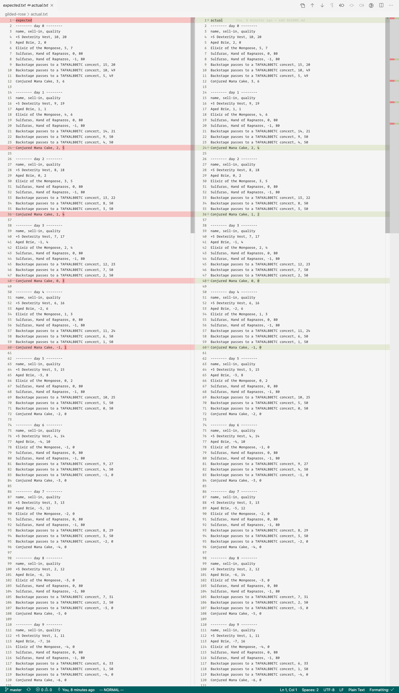

# README

Basic [Racket](racket) solution for the [gilded rose kata](gilded-rose).

## Installation

- Racket, which you can get [download here](download-racket) or, if you're on macOS, run `brew cask install racket`.

## Tests

```bash
raco test gilded-rose.rkt

> raco test: (submod "gilded-rose.rkt" test)
> 19 success(es) 0 failure(s) 0 error(s) 19 test(s) run
> 0
> 19 tests passed
```

## Running

```bash
racket main.rkt
```

This will execute a 31-day cycle and print the output to `stdout`.

Alternatively you can run redirect the output to a file, `actual.txt` and compare it with `expected.txt`:

```bash
racket main.rkt > actual.txt
diff expected.txt actual.txt
```

The output should be something along the lines of:

```bash
1c1
< expected
---
> actual
24c24
< Conjured Mana Cake, 2, 5
---
> Conjured Mana Cake, 2, 4
36c36
< Conjured Mana Cake, 1, 4
---
> Conjured Mana Cake, 1, 2
48c48
< Conjured Mana Cake, 0, 3
---
> Conjured Mana Cake, 0, 0
60c60
< Conjured Mana Cake, -1, 1
---
> Conjured Mana Cake, -1, 0
```

It's unclear to me if the [TextTests](texttests) are wrong: the way `Conjured` items devaluate in the test file seems to not respect the definition, i.e.

> “Conjured” items degrade in Quality twice as fast as normal items



[gilded-rose]: https://github.com/emilybache/GildedRose-Refactoring-Kata
[racket]: https://racket-lang.org/
[download-racket]: https://download.racket-lang.org/
[texttests]: https://github.com/emilybache/GildedRose-Refactoring-Kata/blob/master/texttests/ThirtyDays/stdout.gr
